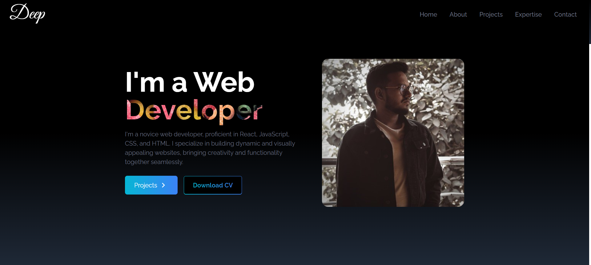
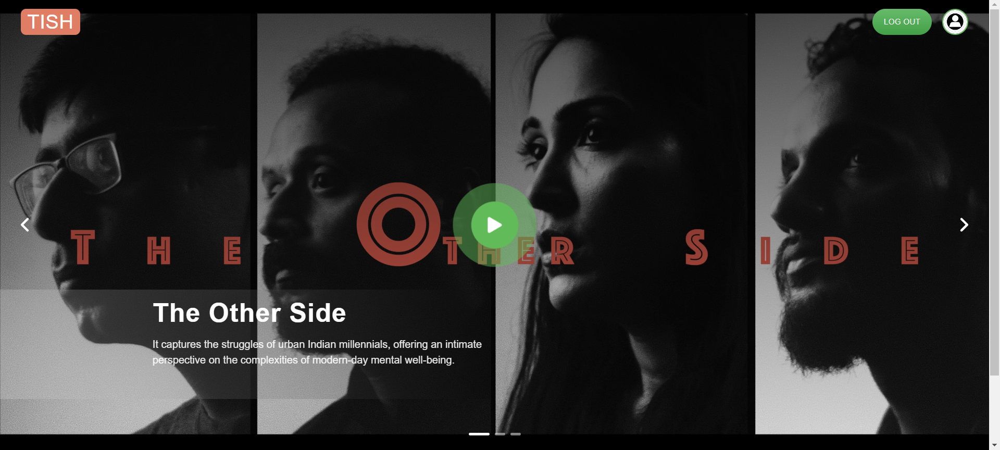
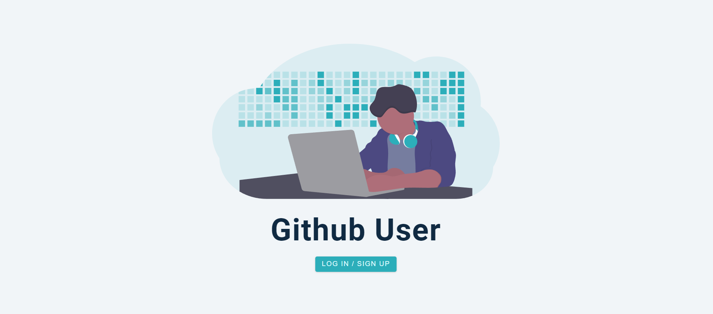

# Hi 👋 I'm **Deep Sankar De**

I am a _"Software Developer from India"_

## 🛠 Technical Skills

|  HTML5       |  CSS3                               |  JavaScript             |
| ----------------------------------------------------------------------- | ------------------------------------------------------------------------------------------- | ------------------------------------------------------------------------------------------- |
|  React |  Next.js |  Java               |
|  MySQL   |  Firebase                   |  Postman |

*Continuous learning and staying updated with the latest trends is the way* 

## 📚 Projects

| Project | Description |
| --- | --- |
|  | [**My Portfolio**](https://github.com/Deep-dsd/my_portfolio)   • Working with ReactJS. Implementing React hooks, and functional components.   • Implementing modern and responsive layout. |
|  | [**Tish**](https://github.com/Deep-dsd?tab=repositories)   • Working with Next.js, Using UI libraries like Material Tailwind.   • Working with Firebase, using Firebase for Authentication and Firestore for storing data. |
|  | [**Github Buddy**](https://github.com/Deep-dsd/github-search-users)   • Working with Styled Components, React hooks, Chart.js, localStorage.   • Getting comfortable with API calls. Using Auth0 for user authentication. |

---

***May the Force Be with You*** 

